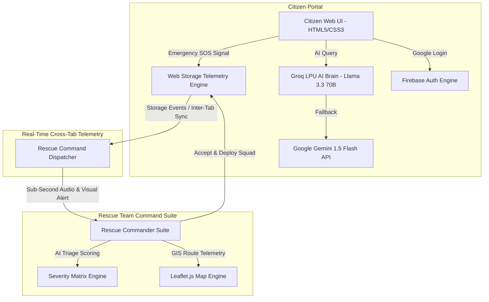

# 🛠️ AEGIS: Technical Architecture & Technology Stack Specification

**Project Name:** AEGIS — AI-Powered Real-Time Flood Response & Tactical Rescue Operations Platform  
**Target Domain:** Smart India Hackathon (SIH) — Disaster Management & Life Safety  
**Target Agency:** Assam State Disaster Management Authority (ASDMA), NDRF, SDRF  

---

## 📐 System Architecture Diagram

---

## 📊 Comprehensive Tech Stack Matrix

| Module / Component | Primary Technology | Version / API | Function & Implementation Purpose |
| :--- | :--- | :--- | :--- |
| **High-Speed AI Brain** | `Groq Cloud LPU` | Llama 3.3 70B Versatile | Sub-second (500+ tokens/sec) emergency AI responses & guidance. |
| **Backup Generative AI** | `Google Gemini API` | Gemini 1.5 Flash | Secondary high-availability generative reasoning model fallback. |
| **Authentication & Profile** | `Firebase Auth` | Web SDK v10 Compat | One-click Google OAuth 2.0 sign-in & cross-page profile sync. |
| **GIS & Mapping Engine** | `Leaflet.js & Leaflet.heat` | v1.9.4 & v0.2.0 | OpenStreetMap tiles, custom DivIcons, heatmaps & route polylines. |
| **Real-Time Telemetry** | `Web Storage API` | `localStorage` + `storage` events | Sub-second cross-tab SOS alerts & automatic tracking unlock. |
| **Audio Alert Subsystem** | `Web Audio API` | Native Browser API | Synthetic 880Hz audio alarm for incoming Rescue SOS alerts. |
| **Data Analytics** | `Chart.js` | CDN v4 | Interactive line, bar, radar & doughnut charts for risk metrics. |
| **Frontend UI/UX** | `HTML5 & Vanilla CSS3` | Custom Glassmorphic Dark | Ultra-fast dark mode UI, CSS Grid/Flexbox layouts & micro-animations. |
| **Iconography & Fonts** | `Font Awesome & Google Fonts` | 6.4.0 & Plus Jakarta Sans | Modern typography and vector emergency iconography. |
| **Local Web Server** | `Python http.server` | Python 3.x | Lightweight HTTP server with no-cache headers for dev testing. |

---

## 🏗️ Detailed Module-by-Module Technical Breakdown

### 1. 🧠 High-Speed Generative AI Engine (Groq LPU + Gemini)
* **Groq LPU Engine:** Communicates with Groq’s high-speed inference cloud via REST API (`https://api.groq.com/openai/v1/chat/completions`) utilizing `llama-3.3-70b-versatile`.
* **Google Gemini 1.5 Flash:** Provides secondary natural language reasoning fallback via Google AI Studio (`v1beta/models/gemini-1.5-flash`).
* **Intelligent Electrical & Safety Heuristic:** Local fallback rules catch high-risk queries (e.g. submerged main switchboards) to issue instant life-saving protocols.

---

### 2. 🔐 Firebase Authentication & Dynamic Profile Sync
* **SDK Version:** Firebase JavaScript SDK v10 Compat (`firebase-app-compat.js`, `firebase-auth-compat.js`).
* **Authentication Provider:** Google OAuth 2.0 (`GoogleAuthProvider`).
* **Profile Synchronization Engine:** Custom JavaScript module ([`js/firebase-auth.js`](file:///c:/Users/bhuva/Downloads/flood%20detection/js/firebase-auth.js)) extracts user Google account name, email, and photo URL, updating all topbars and [`citizen-profile.html`](file:///c:/Users/bhuva/Downloads/flood%20detection/citizen-profile.html) in real time.

---

### 3. 🚨 Sub-Second Real-Time Telemetry & Dispatch Sync
* **Mechanism:** Shared `localStorage` state broadcast combined with window `storage` event listeners (`window.addEventListener('storage', ...)`).
* **Workflow:**
  1. Citizen clicks **"Send SOS Report"** on `citizen-sos.html`.
  2. Telemetry payload sets status to `PENDING_APPROVAL` and triggers a storage broadcast event.
  3. **ANY Rescue page** (`rescue-dashboard.html`, `rescue-map.html`, `rescue-sos.html`, etc.) catches the event and triggers an urgent **Red Alert Modal** with sound.
  4. Clicking **"Accept & Deploy Rescue Team"** updates status to `APPROVED`, automatically redirecting the citizen to `citizen-tracking.html` with live GPS speedboat tracking.

---

### 4. 🗺️ Interactive Maps, GIS & Tactical Navigation
* **Mapping Engine:** Leaflet.js rendering OpenStreetMap tiles.
* **Custom Layers:**
  * **SOS Pin Markers:** Pulsing red DivIcons for citizen distress locations.
  * **Rescue Unit Pins:** Green boat DivIcons representing NDRF/SDRF Speedboats.
  * **Route Polylines:** Animated dashed green polylines representing active rescue boat trajectories.
  * **Flood Heatmaps:** Dynamic density heatmaps powered by `leaflet-heat.js`.

---

### 5. 🔊 Web Audio API Emergency Alarm Subsystem
* **Implementation:** Built using native `AudioContext`, `OscillatorNode`, and `GainNode`.
* **Function:** Synthesizes an 880Hz A5 audio pulse when an emergency distress report is received, ensuring command officers are alerted even if looking at another monitor.

---

### 6. 🎨 CSS3 Glassmorphism UI & Performance Optimization
* **Aesthetics:** Sleek dark-mode glassmorphic interface (`background: rgba(7, 13, 29, 0.88); backdrop-filter: blur(20px);`).
* **Zero Framework Overhead:** Built entirely without bulky JavaScript frameworks (like React or Angular) to ensure 60 FPS performance and sub-second load times on low-bandwidth 2G/3G flood networks.
* **HTTP Cache Invalidation:** `Cache-Control: no-cache, no-store, must-revalidate` headers configured to ensure zero stale cache responses during live demonstrations.

---

**AEGIS Project Repository Path:** `c:\Users\bhuva\Downloads\flood detection\`  
**Document Generated At:** 11 August 2026  
